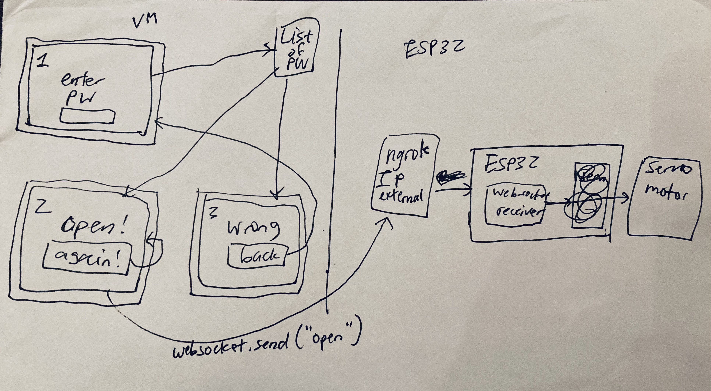

# Doorbot

## Goal:
I would like to access a website and press a button to control a servo motor wirelessly. It will be controlled by an Espressif ESP32.

## Setup

There is an esp32 folder with files that will be uploaded onto the board, an a web folder for files that will eventually run on a server in an external VM. There is a `/esp32/wifi.txt` file that contains the wifi information for the board. There will also be a `/web/password.txt` that contains a list of current valid passwords.

A rough sketch of what the system will look like:

Some original code from: https://github.com/madhephaestus/ESP32Servo/blob/master/examples/Knob/Knob.ino

## Some helpful commands

Finds PID of processes: `sudo lsof -n | grep "UART"`
