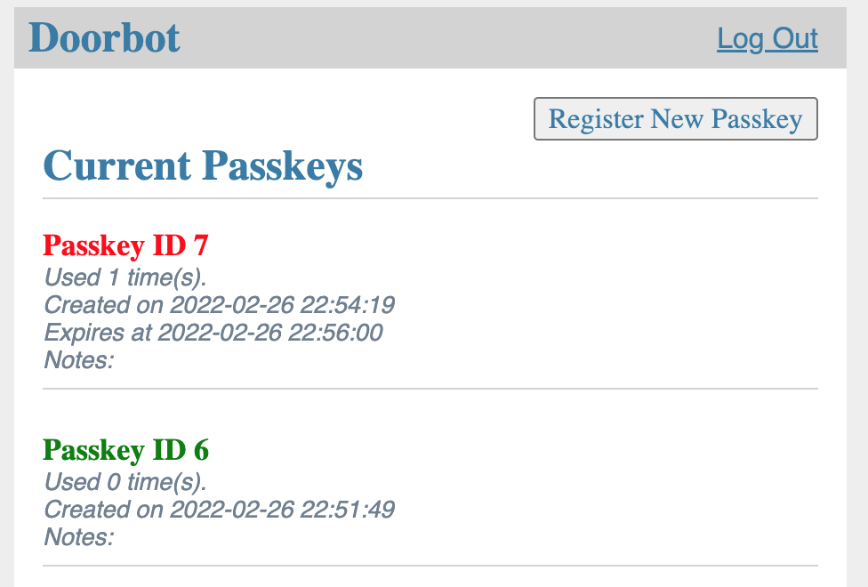

# Doorbot website

This is a simple website running with Flask (Python) backend and SQLite db largely influenced by the [Flask tutorial](https://flask.palletsprojects.com/en/2.0.x/tutorial/).

### About the app

Admins can only be made by the Flask CLI command `add-admin`. New passkeys can only be made by admins and can be done through the website (URL TBD).

Passkeys have several properties:
* Expiration
* Number of uses
* Notes

A passkey will be rejected if it is either past the expiration date or has been used more than its allocated number of times.

Passkeys are stored as salted hashes in the SQLite db. However I would not recommend using passkeys that you are using someplace else.

Go to `URL/admin.html` (if you have an admin passkey) in order to access the admin page and view status on all passkeys ever given out.



### How to use

Every time you run the Flask app in a new terminal, run:
```
source venv/bin/activate
export FLASK_APP=webapp
export FLASK_ENV=production
```

If you are using this venv for the first time, run:
```
pip install -r requirements.txt
```

To wipe the existing db and start over (or running an instance for the first time), run:
```
flask init-db
```

To add an admin, run:
```
flask add-admin $ADMIN_PW_OF_YOUR_CHOICE
```

To restart an instance, run:
```
flask run --host=0.0.0.0
```

You'll probably want to run all three of these lines the first time you set up or if you are starting over.


### How it works?

Some vague concepts, mostly for my own future's reference.

A flask app is created in `__init__.py`, which calls python files `auth.py`, `db.py`, and `internal.py`. Auth handles logging in and registering (a new passkey). DB gives us access to the SQLite database (which is stored in an `instance` folder outside of `webapp`). Internal renders the page to open the door and the admin page that catalogs all of the existing passkeys. Each of these python files renders an HTML file that is generated from the HTML Jinja templates in the `templates` folder. Jinja basically takes inputs from the python function and uses them to dynamically change the HTML.

CLI commands to access the database have to be run within the Flask app context and are best defined in `__init__.py` alongside the app itself. I think the only use for this right now is creating an admin user.
